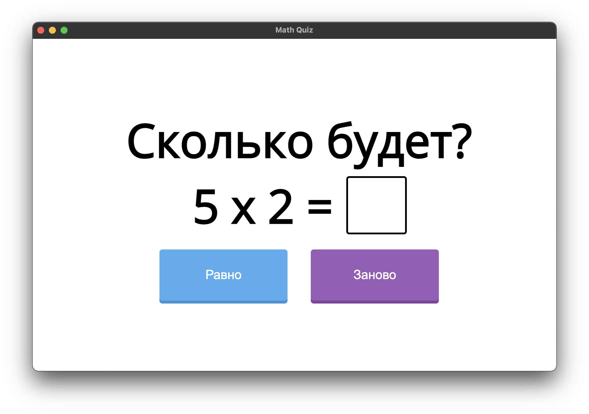
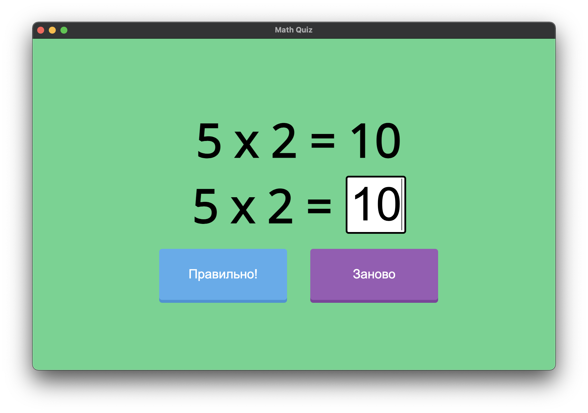
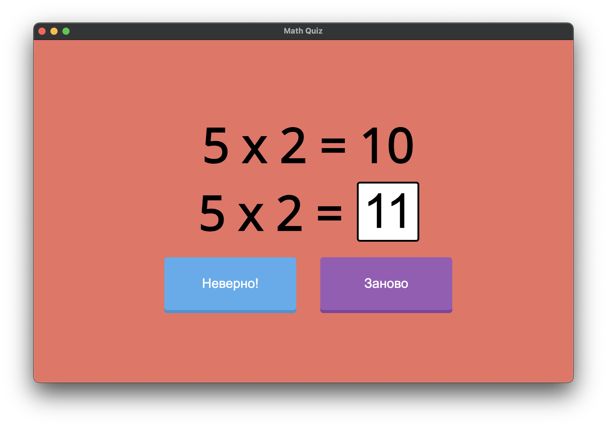

# Electro Math Quiz

This is a simulator for the multiplication table from 0 to 10.
This application was created using the Electron library. The app uses languages HTML, CSS, JS. 
Electron helped make the application cross-platform and run on systems such as Windows and MacOS in the same way.
The design of the application is as simple and pleasant as possible for the child, and depending on the answer, a sound will be made.

